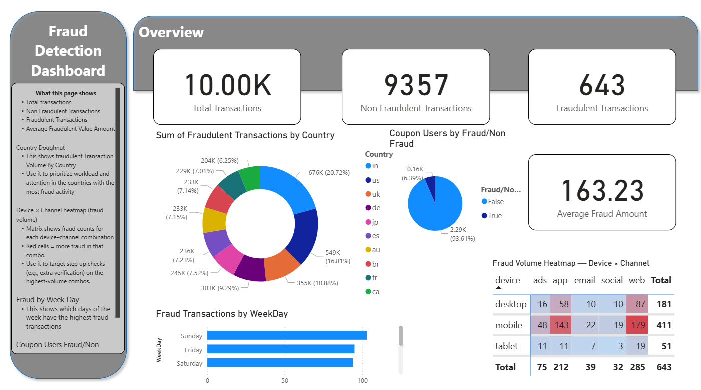
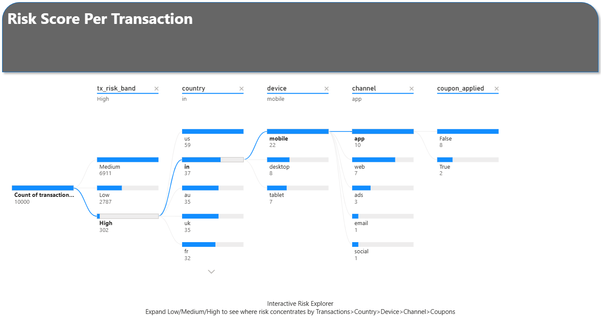

# E-Commerce Fraud Detection Capstone Project

This project involves the analysis of e-commerce transactional data to gather meaningful data and insights to help identify fraudulent transactions. The project encompasses data extraction, transformation, and loading (ETL), exploratory data analysis (EDA), and the creation of data visualizations to support findings.

The dataset contains various features related to transactions, including transaction amount, time, location, method of transaction, devices used, and whether a coupon was applied. The goal is to identify patterns and characteristics of fraudulent transactions to aid in fraud detection.

At a glance:
* Audience: Fraud operations / risk analysts (technical and non-technical)
* Goal: Identify when/where/how fraud occurs, communicate insights clearly, and propose practical controls to minimise fraud risks.
* Scope: Jupyter Notebooks for ETL, EDA, Data Visualisations and PowerBi Dashboard for interactive data exploration.

# 

# Dataset Source & Content
The dataset we are using was found on Kaggle:
https://www.kaggle.com/datasets/wafaaelhusseini/synthetic-fraud-transactions

The dataset contains the following:
- Transaction_ID: Unique identifier for each transaction
- User_ID: Unique identifier for each user (anonymised)
- Timestamp: Date and time of the transaction
- Amount: Monetary value of the transaction
- Country: Country where the transaction originated
- Device_Type: Type of device used for the transaction (e.g., mobile, desktop)
- Channel: Channel through which the transaction was made (e.g., web, app)
- Hour: Hour of the day when the transaction occurred
- Day_of_Week: Day of the week when the transaction occurred
- Coupon_Applied: Indicates whether a coupon was applied to the transaction (True/False)
- Is_Fraud: Indicates whether the transaction was fraudulent (1 for fraud, 0 for non-fraud) (True/False)
- Synthetic data generated to simulate real-world e-commerce transactions with no PII (Personally Identifiable Information).

# Project Purpose & Overview

This project delivers a lightweight analytics pipeline to support day-to-day fraud operations:
- ETL (Jupyter, Python): cleaned, standardised and validated raw data.
- EDA (Jupyter): discovered trends, patterns and anomalies. Also performed feature engineering. Mean, Median, Cohen's d test and grouping analysis.
- Notebook Visualisations: simple and easy to follow, reproducible plots (matplotlib/seaborn).
- Power BI Dashboard: interactive, business-ready views for decision-makers.

Key decisions enabled

- Thresholding: step-up checks for high-amount bands / high-risk bands.
- Scheduling: staff/rules during hot hours and peak day×hour pockets.
- Targeted controls: stricter checks for risky device×channel combos and countries.
- Promo safeguards: tighten coupon flows if fraud share is elevated.
- Peaks in fraud rates by time of day and day of week.

# Business Requirements

- Quantify fraud rates by time, location, device, channel, amount bands and coupon usage.
- Identify high-risk segments and patterns to inform fraud prevention strategies.
- Provide actionable insights to reduce fraud incidence and financial losses.
- Deliver clear, concise visualisations for technical and non-technical stakeholders.

# Methodology Steps:
1. Business Understanding: Define objectives, understand fraud context, identify key metrics.
2. Data Understanding: Explore dataset, assess quality, identify relevant features.
3. Data Preparation: Clean, transform, and engineer features for analysis.
4. Exploratory Data Analysis (EDA): Analyze data distributions, correlations, and patterns.
5. Data Visualisation: Create plots and dashboards to communicate findings.
6. Insights & Recommendations: Summarize findings, propose fraud mitigation strategies.

# Data Management:
- (Raw) Primary File: Dataset/Raw/transactions.csv
- (Cleaned) Transformed File: Dataset/Cleaned/cleaned_transactions.csv
- Enriched & Feature Engineered File: reports/tables/transaction_risk_scores.csv
- Data Visualisations Charts: reports/figures/
- Power BI Dashboard File: PowerBI/E-Commerce Fraud Detection.pbix
- Power BI Dashboard File Direct Download Link: https://drive.google.com/file/d/1K2Vjt9SIGJmdu0sCePsocEaRB0j4Jh_k/view?usp=sharing

# Ethical Considerations:
- Data Privacy: This dataset ensures no PII is used; synthetic data mitigates privacy risks. If real data were used in practice, strict data governance and anonymization protocols would be essential such as least privilege access, encryption, and compliance with regulations (e.g., GDPR).
- Bias & Fairness: Vigilance against biases in fraud detection models is crucial to avoid unfairly targeting specific user groups. Regular audits and fairness assessments should be conducted to ensure equitable treatment across demographics.

# Hypotheses and how to validate:

H1: Fraud rates are higher on weekends compared to weekdays.
- Validation: Compare fraud rates between weekends and weekdays using charts.
- Evidence: reports/figures/04_fraud_rate_by_dayofweek.png

H2: Fraudulent transactions are likely to have a higher average amount than non-fraudulent ones.
- Validation: Compare average transaction amounts for fraudulent vs. non-fraudulent transactions using box plots.
- Evidence: reports/figures/03_avg_amount_by_class.png

H3: Certain countries have a higher incidence of fraud compared to others.
- Validation: Analyze fraud rates by country using bar charts.
- Evidence: reports/figures/06_fraud_rate_by_country_top10.png

H4: Certain device types and channels are more commonly associated with fraudulent transactions.
- Validation: Examine fraud rates by device type and channel using heat map.
- Evidence: reports/figures/08_heatmap_device_by_channel.png

H5: Non Fraudulent transactions are likely to be more frequent than fraudulent transactions.
- Validation: Compare counts of fraudulent vs. non-fraudulent transactions using bar chart.
- Evidence: reports/figures/01_class_balance.png

The hypotheses can be validated by the visualisations provided in the reports/figures/ directory and Power BI dashboard. Each visualisation corresponds to a specific hypothesis and provides insights into the patterns and trends in the data.

# Key Findings & Insights:

- Fraud is imbalanced (about 6.43% overall)
- Amounts are clearly higher on fraud; high spend should trigger step-up checks.
- Time matters: days and hours show spikes, so I’d schedule staff/rules for those windows.
- Segments matter: certain devices/channels/countries have noticeably higher fraud rates.
- Coupons: 24.3% of all fraud transactions involved coupons
- Risk bands: High transaction amounts correlate with higher fraud rates.

Prevention Measures:

Add additional checks on accounts when trying to make large transactions.

Staff or tighten rules during high-risk windows for example on weekends when fraud is more likely.

Apply stricter verification in the riskiest device–channel combos and countries for example Emails on a tablet.

Add velocity/limits for coupon flows.

# Dashboard Visualisations:

- Overview: key KPIs (Total Tx, Fraud Tx, Fraud Rate %, Total Amount, Avg Fraud Amount), Top Fraud Countries (donut), Device×Channel heat matrix.
- Time: fraud rate by day and hour, with labels turned on so the % is obvious; optional day×hour heat matrix.
- Segments: fraud rate by device/channel/country (Top N for readability).
- Amount & Basket: fraud rate by amount bins, average amount by class, and rate by num_items bins.
- Promo: “coupons within fraud” pie and “fraud within coupon users”.
- Risk Explorer: a Decomposition Tree to click through Low/Med/High by country/device/channel/hour.

I used slicers, doughnut charts, heat maps, bar charts, pie chart and a decomposition tree which are all interactive and user-friendly. There is also a description text box on each page explaining the charts and what they are showing.

# Best Practices:
Coding & ETL:
- Followed best practices for ETL steps: data extraction, cleaning, transformation, and loading.
- Well documented steps with comments and markdown cells.
- Modular code with functions for reusability.
- Stored with clear file paths.

Visualisations & Dashboard:
- Clear titles, axis labels, legends, and annotations.
- Use rates (%) whenever the target is imbalanced.
- Keep visuals clean: Top N where categories explode; data labels ON for % charts.
- Sort things in a human way (Mon→Sun, 0→23, bins from low→high).
- Keep colours consistent for fraud vs non-fraud.

# Bugs and Fixes:
- Ploty gave me a few issues with rendering within Jupyter Notebooks. I switched to Matplotlib/Seaborn for static plots which worked better.
- Pies/Donuts sometimes showed nothing → I set Values = Count of transaction_id, applied Top N, and used a visual-level filter (e.g., is_fraud = 1).
- Had a few issues in PowerBi with rendering charts with "day" so i had to manually use an "elif" statement to assign day names. (e.g., 0 = Sunday, 1 = Monday, etc.)
- Matrix looked noisy → background colour scale + Top N on categories

# Project Review and Conclusion:
Overall, the ETL process was easy and straightforward, thanks to the synthetic datset. There was no need for extensive data cleaning but all of the normal checks were still performed to ensure data quality. In the EDA we identifyed key patterns and trends, and also performed feature engineering and grouping, which helped to create a more robust model. The dashboard answers when, where, and how much fraud is happening and turns that into practical actions: step-up thresholds, staffing windows, segment-specific checks, and promo safeguards.The focus on rates over counts fits an imbalanced problem.

Limitations:
- The dataset is synthetic and may not capture all real-world complexities of e-commerce fraud.
- The fraud rate is relatively low, which may limit the effectiveness of certain statistical analyses.

Next steps:
- Impliment a score calibration model over time to track changes in fraud patterns and effectiveness of controls. In a real world scenario, i would implement more collected data such as IP address, browser fingerprints, shipping vs billing address mismatches, etc. to paint a better picture of fraud patterns.

# Maintainance & Evaluation Plan:
- Refresh: monthly data import and dashboard refresh.
- Watch these KPIs: Fraud Rate %, Fraud Count, share of High risk band, Avg Fraud Amount.
- Drift checks: look at fraud rate by day/hour and by risk band each month.

# Ai Assistance:
I used AI tools such as ChatGPT and Github Copilot to help with code snippets, debugging, and helping with my README.md file layout. I ensured that all code was reviewed and understood before implementation to maintain code quality and integrity. I did find that the AI could handle small coding tasks well but struggled with larger and more complex tasks which was actually detrimental to my notebooks as it started causing errors and bugs. I therefore limited my use of AI to small tasks only. If AI is used in a professional setting, it is important to ensure that all code is reviewed and tested thoroughly to avoid potential issues.

# How to run the code:
Prereqs:
- Python 3.12.8
- Power BI Desktop (Windows)

1. Copy Github HTTPS repo link
2. Open VSCode > View > Command Palette > Git: Clone Repository > Paste link > Select local folder.
3. Open the project folder in VSCode.
4. Create and activate a virtual environment: Command Palette > Python: Create Environment > Select venv > Select Python 3.12.8 interpreter.
5. In Jupyter Notebooks, Select Kernel > Python 3.12.8 (venv).
6. Install dependencies: Open terminal > `pip install -r requirements.txt`

# Credits & Acknowledgements:
- Dataset: Wafaa Elhusseini (Kaggle) - https://www.kaggle.com/datasets/wafaaelhusseini/synthetic-fraud-transactions
- Code Institute for the project structure and Assessment criteria.
- ChatGPT and Github Copilot for code snippets and debugging assistance.
- To Vasi and the team at Code Institute for their Teaching, Support and Guidance, which has gotten me from a complete beginner to being able to complete this project.
Thank you for taking the time to review my project!